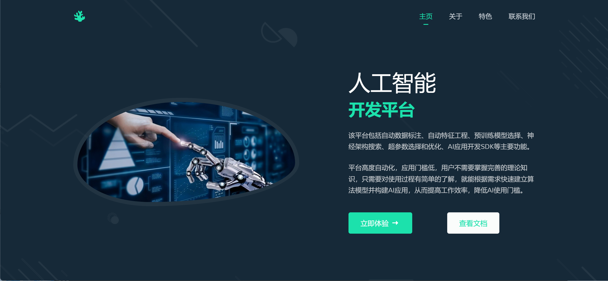
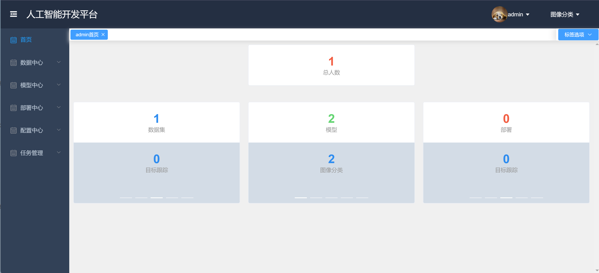
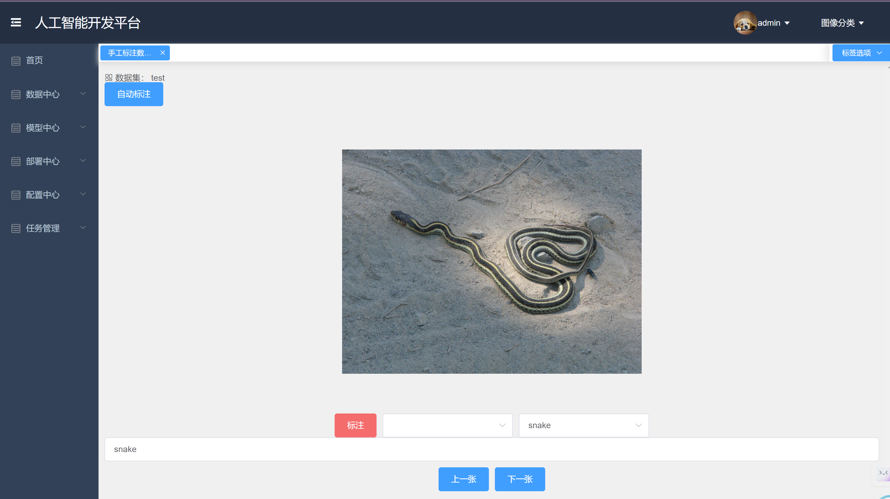
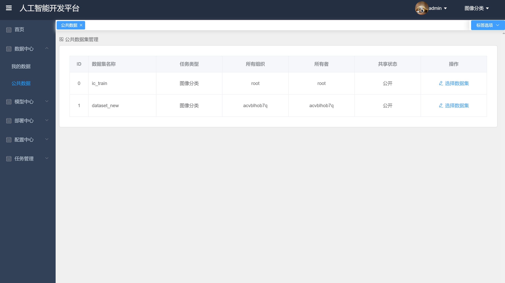

# AIPlatform-Frontend

  
  
  
  

基于 Vue3 + Element Plus 的后台管理系统解决方案。[线上地址](https://AIPlatform-Frontend.vercal.app)

## 项目截图

### 欢迎页(单独页面)

### 首页

### 标注

### 列表

## License

[Mulan PubL v2](https://github.com/hu-qi/AIPlatform-Frontend/blob/main/LICENSE)
